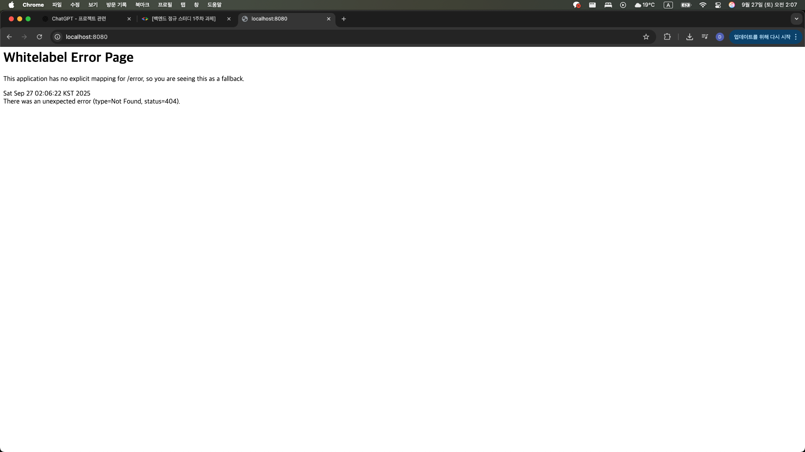

# 백엔드 정규 스터디 1주차 학습 정리
**주제: 웹의 소통 방식, HTTP와 REST API**

---

## 1. 웹과 인터넷
- **인터넷**: 전 세계 컴퓨터와 기기를 연결하는 글로벌 네트워크
- **웹(Web)**: 인터넷 위에서 동작하는 대표 서비스. 사용자들이 정보를 공유할 수 있는 공간
- **클라이언트-서버 모델**
    - **클라이언트(Client)**: 요청(Request)을 보냄 (브라우저, 앱 등)
    - **서버(Server)**: 요청을 받아 처리하고 응답(Response)을 반환

---

## 2. URL (Uniform Resource Locator)
웹 자원의 위치를 나타내는 주소. 구성 요소:
- **Scheme(Protocol)**: 통신 규약 (예: `http://`)
- **Host**: 서버의 도메인 또는 IP 주소
- **Port**: 통신 포트 번호 (기본 80/443, 생략 가능)
- **Path**: 서버 내 자원의 경로
- **Query**: `?` 뒤에 key=value 형식의 추가 정보

---

## 3. HTTP (HyperText Transfer Protocol)
- **특징**
    - **무상태성(Stateless)**: 서버는 이전 요청 정보를 저장하지 않음
    - **비연결성(Connectionless)**: 응답 후 연결을 유지하지 않음

- **HTTP 요청 구조**
    - Start Line: 메서드, 경로, 버전
    - Headers: 요청 부가 정보
    - Body: 실제 전송할 데이터

- **주요 메서드**
    - `GET` → 리소스 조회
    - `POST` → 리소스 생성
    - `PUT` → 전체 교체 (없으면 새 생성)
    - `PATCH` → 일부 수정
    - `DELETE` → 리소스 삭제

- **HTTP 응답 구조**
    - Status Line: 버전, 상태 코드, 메시지
    - Headers: 응답 부가 정보
    - Body: 실제 데이터

- **주요 상태 코드**
    - `200 OK` → 요청 성공
    - `201 Created` → 생성 성공
    - `400 Bad Request` → 클라이언트 요청 오류
    - `404 Not Found` → 리소스 없음
    - `500 Internal Server Error` → 서버 오류

---

## 4. 프론트엔드와 백엔드
- **프론트엔드 (Front-end)**: 사용자와 직접 상호작용하는 화면(UI)
- **백엔드 (Back-end)**: 요청을 처리하고 DB와 상호작용 후 결과 반환

- **데이터베이스(DB)**
    - 데이터를 체계적으로 저장·관리
    - 특징: 중복 방지, 독립성, 무결성 유지
    - 대표 DBMS: MySQL, PostgreSQL, MongoDB

- **게시판 예시**
    - `GET /posts/100` → 게시글 조회
    - `POST /posts` → 게시글 작성

---

## 5. API와 REST API
- **API (Application Programming Interface)**  
  프로그램 간 기능·데이터를 주고받는 규칙

- **REST (Representational State Transfer)**  
  HTTP를 활용한 아키텍처 스타일
    - **자원(Resource)**: URI로 표현 (`/student/1`)
    - **행위(Verb)**: HTTP 메서드 (`GET`, `POST`, `PUT`, `DELETE`)
    - **표현(Representation)**: JSON 등 데이터 형식

- **REST API**: REST 원칙을 준수한 API

- **RESTful API 예시 (회원 관리)**
    - `POST /members` → 회원 등록
    - `GET /members` → 회원 리스트 조회
    - `GET /members/{memberId}` → 회원 상세 조회
    - `PATCH /members/{memberId}` → 회원 정보 수정
    - `DELETE /members/{memberId}` → 회원 삭제

---

## 6. Spring & Spring Boot
- **Spring**
    - 자바 기반 백엔드 프레임워크
    - 객체지향의 장점을 살려 안정적이고 확장성 있는 앱 개발 지원

- **Spring Boot**
    - 복잡한 설정 없이 Spring을 쉽게 사용할 수 있도록 지원
    - 빠른 개발과 실행 환경 제공

---

# 과제 스크린샷 첨부

---

# 온라인 쇼핑몰 api 명세서
## 상품(Product)
| 기능 | HTTP Method | URI |
|---|---|---|
| 상품 정보 등록 | POST | /products |
| 상품 목록 조회 | GET | /products |
| 개별 상품 정보 상세 조회 | GET | /products/{productId} |
| 상품 정보 수정 | PATCH | /products/{productId} |
| 상품 삭제 | DELETE | /products/{productId} |

## 주문(Order)
| 기능 | HTTP Method | URI |
|---|---|---|
| 주문 정보 생성 | POST | /orders |
| 주문 목록 조회 | GET | /orders |
| 개별 주문 정보 상세 조회 | GET | /orders/{orderId} |
| 주문 취소 | POST | /orders/{orderId}/cancel |